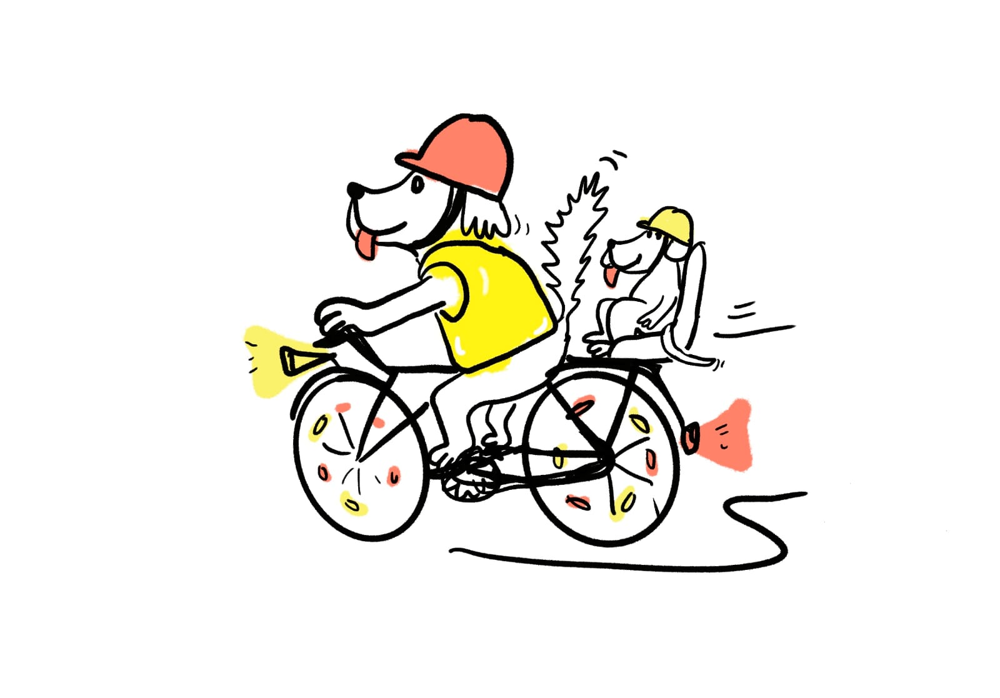
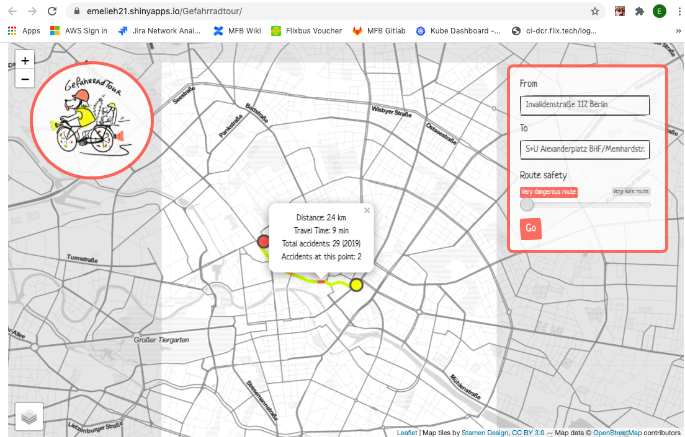
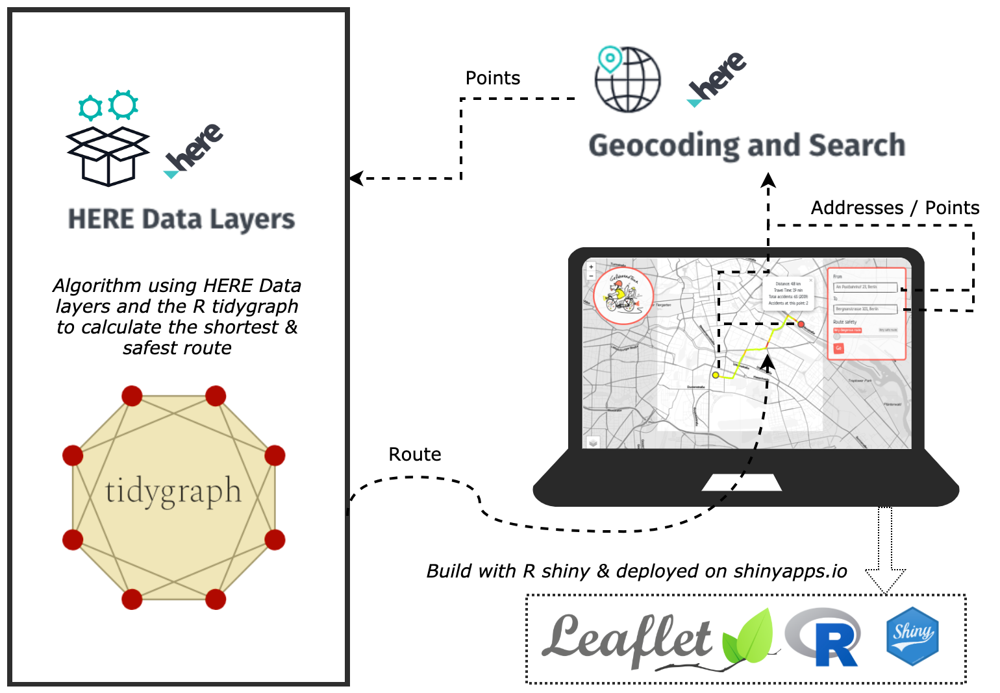

<p align="right" style="margin-bottom: -5em;">
	
</p>
<h1>Gefahrradtour</h1>

Project for the HERE Map Data Hackathon 2020. Find the safest route from A to B in Berlin thanks to HERE Data Layers and Berlin traffic accident data.

### How are we helping with this project?
Road safety is an important issue in many cities. In Berlin in 2019 alone over 13.000 road accidents occured, **every 3 hours a biker or pedestrian had an accident** (almost 4000 accidents involved bikers or pedestrians) [1]. 34 accidents were fatal. We therefore created an app that shows you the shortest but also the safest route that helps you avoid dangerous streets and intersections to arrive safely to a destination of your choice.


### The data
The Gefahrradtour App is based on two data sets:

1. **Navigable roads from HERE Data Layers**
The roads data set used for calculating the route between two points was provided by HERE for the hackathon in a geojson file. It contains 18916 road segments covering a section of Berlin which inlcudes most of its central districts (see Figure 1).
	
		
2. **Accidents in Berlin 2019**
This data set contains all accidents that occured in Berlin in 2019 [1] involving cars, bikers and pedestrians. For each accidents its coordinates, severity (from 1-3) and type are given. In total there where 13390 accidents recorded.


### How routes are computed
To find the route between two coordinates we used the **navigable roads dataset** in the [HERE data layers](https://developer.here.com/products/data-layers).
Using the tidygraph library in R, the road data was preprocessed into a graph G(V,E), where V represents its sets of nodes and E its set of edges. All road segments represent egdes and all intersections represent nodes.
The road graph serves as input into the shortest path algorithm, for which we used the **Dijkstra's algorithm** [2]. This algorithm outputs the shortest path between two nodes in a graph. It takes into account the edges' weights. If the user selects the "_very dangerous route_" in the shinyapp, these edge weights are simply the length of each road segment. If "_very safe route_" is selected, we check how many accidents occured on a road segment and add 300 m to this edge's length for each accident that occured on it. We choose 300 m since this produced the most logical routes with a good balance of route safety and route length. We counted accidents with severe injuries as two accidents and those that lead to a death as three accidents.

### How the app works
The app allows the user to select a starting point and a destination (either by typing the address or clicking on the map) and to choose either the fastest route (_very dangerous route_) or the safest route (_very safe route_). Once the route is generated you can see which parts of the route are more dangerous (red color indicates higher number of accidents) and how many accidents happened on that route in total (based 2019 data). 



**The app can be visited [here](https://emelieh21.shinyapps.io/Gefahrradtour/)**. Currently, this demo version of the app is only available for the restricted area of Berlin for which we have data on navigable roads available.

### Technologies used in the app

The app is build with R Shiny (see the [app.R](app.R) script). For all the mapping functionality, it used the Leaflet package and the theme applied is [Bootstrap Sketchy](https://bootswatch.com/sketchy/). For the geocoding and reverse geocoding we used the [HERE Geocoding and Search API](https://developer.here.com/products/geocoding-and-search). As explained above the routes are computed using an algorithm to find the shortest path between two points using the navigable roads data set from the HERE data layers.


### Deploying the demo app
The demo app is deployed with [shinyapps.io](https://www.shinyapps.io/admin/). To use shinyapps.io, all you need is an account & the rsconnect package for R (`install.packages("rsconnect")`). Under **Account > Tokens** you can find the command with the credentials that looks something like this:

```R
rsconnect::setAccountInfo(name='<YOUR USERNAME>', 
	token='<YOUR TOKEN>', 
	secret='<YOUR SECRET>')
```
After you run this in Rstudio, a tiny icon should show up next to the "Run App" button (when you have your shiny app script opened). Here you can select **Publish Application**. 

The demo app can be found here: [https://emelieh21.shinyapps.io/Gefahrradtour/](https://emelieh21.shinyapps.io/Gefahrradtour/).

### Solution architecture


### References
- [1] Amt für Statistik Berlin-Brandenburg (2019). Strassenverkehrsunfälle nach Unfallort in Berlin 2019. mt für Statistik Berlin-Brandenburg (visited November 2020).
- [2] West, D.B. (1996). Introduction to Graph Theory. Upper Saddle River, N.J.: Prentice Hall.

